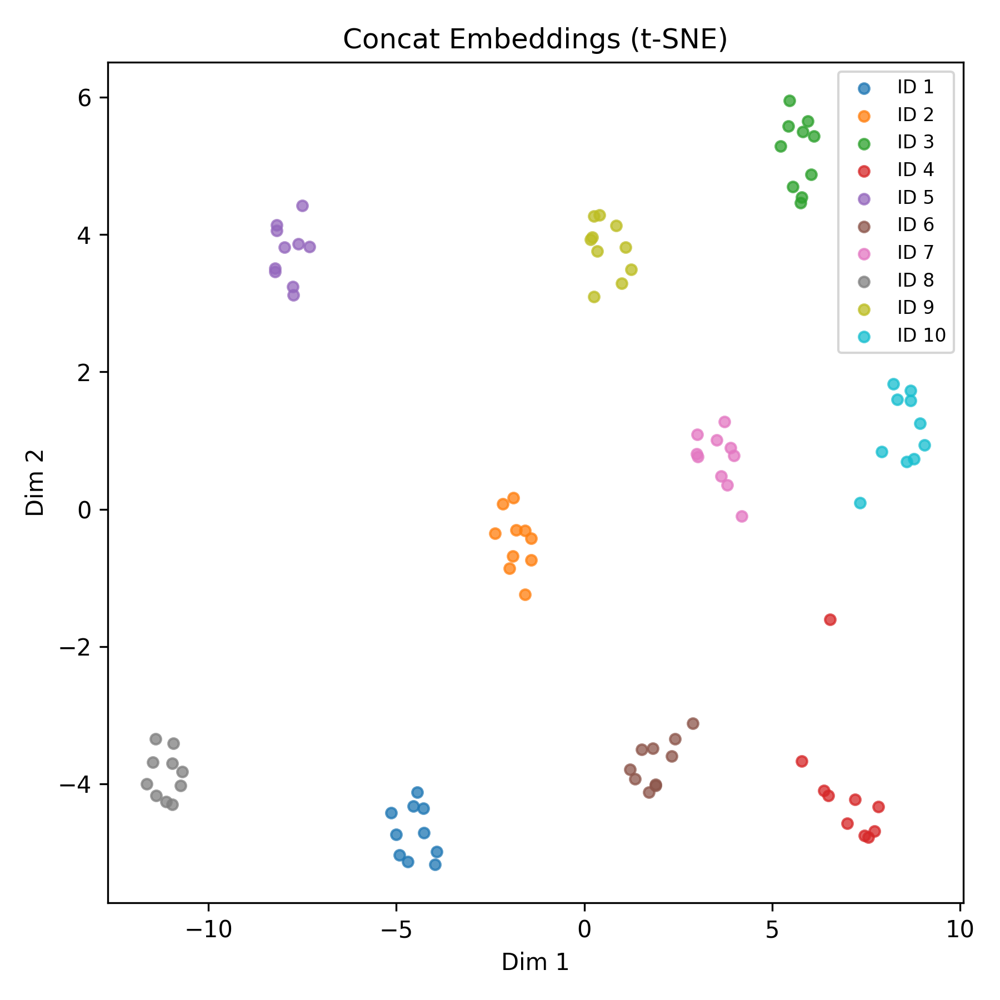

# MVTC Multimodal Embedder

Multimodal Embedder는 사전학습된 CLIP·BERT 임베더와 TSTF 촉각 오토인코더를 활용해 이미지·텍스트·촉각 데이터를 단일 임베딩 벡터로 정렬하는 베이스라인입니다. 각 모달리티 임베딩을 추출한 뒤 촉각 잠재벡터를 참조(CLIP+텍스트) 임베딩 뒤에 concat하여 `.npz` 아카이브와 시각화를 생성합니다.

## 디렉터리 구조

```
mvtc_multimodal/
├── app/
│   ├── config/
│   │   ├── default.yaml
│   │   └── quick.yaml
│   ├── core/
│   │   ├── __init__.py
│   │   ├── concat.py
│   │   ├── config_loader.py
│   │   ├── data.py
│   │   ├── embedders.py
│   │   ├── scaler.py
│   │   ├── tactile.py
│   │   └── visualization.py
│   └── utils/
│       ├── __init__.py
│       ├── dataset.py
│       ├── embeddings.py
│       └── path.py
├── data/
│   ├── img/
│   ├── img_vocab/
│   └── time_data/
├── model/
│   └── model.pt
├── outputs/
├── scripts/
│   └── run_mvtc.sh
├── main.py
├── requirements.txt
└── README.md
```

## 주요 특징
- **Multimodal Embedder 베이스라인**: 참조(CLIP+텍스트) 임베딩과 촉각 잠재벡터를 L2 정규화 후 이어붙여 `.npz`와 메타 정보를 저장합니다.
- **시각화 자동 생성**: t-SNE, UMAP 2차원 산점도를 자동 생성하여 클래스 분포를 바로 확인할 수 있습니다.
- **환경 프리셋 제공**: `default.yaml`(대형 모델 + GPU 자동), `quick.yaml`(경량 모델 + CPU 고정)을 제공해 목적에 맞춰 실행할 수 있습니다.

## 실행 방법
1. 의존성 설치
   ```bash
   pip install -r requirements.txt
   ```
2. concat 벡터 및 시각화 생성
   ```bash
   ./scripts/run_mvtc.sh --config app/config/default.yaml \
       --output outputs/concat_embeddings.npz \
       --metadata outputs/concat_embeddings_meta.json
   ```
   또는 직접 실행하려면
   ```bash
   python main.py --config app/config/default.yaml \
       --output outputs/concat_embeddings.npz \
       --metadata outputs/concat_embeddings_meta.json
   ```
   - 기본 실행 시 `outputs/` 아래 `*_tsne.png`, `*_umap.png`가 생성됩니다.
   - `--figure-dir`로 시각화 이미지를 별도 디렉터리에 저장할 수 있습니다.
   - `--no-visualization`으로 그래프 생성을 건너뛰거나, `--tsne-perplexity`, `--umap-n-neighbors`, `--umap-min-dist`, `--seed` 옵션으로 차원 축소 하이퍼파라미터를 조정할 수 있습니다.
3. 빠른 테스트
   ```bash
   python main.py --config app/config/quick.yaml \
       --output outputs/quick_embeddings.npz \
       --metadata outputs/quick_embeddings_meta.json --no-visualization
   ```

## Docker 실행
Docker 이미지를 사용하면 호스트 환경과 분리된 상태에서 동일한 설정으로 애플리케이션을 실행할 수 있습니다. 첫 실행 시 Hugging Face 모델이 내려받아지므로 시간이 다소 걸릴 수 있습니다.

### 이미지 빌드
```bash
docker build -t mvtc-multimodal:latest .
```

### 기본 실행
```bash
docker run --rm \
    -v "$(pwd)/data:/app/data:ro" \
    -v "$(pwd)/model:/app/model:ro" \
    -v "$(pwd)/outputs:/app/outputs" \
    -v "$HOME/.cache/huggingface:/cache/huggingface" \
    mvtc-multimodal:latest \
    --config app/config/default.yaml \
    --output outputs/concat_embeddings.npz \
    --metadata outputs/concat_embeddings_meta.json
```
- `outputs/`는 쓰기 가능한 볼륨으로 마운트해야 결과가 호스트에 저장됩니다.
- Hugging Face 캐시를 재사용하려면 홈 디렉터리 캐시를 `/cache/huggingface`에 마운트합니다.
- 다른 인자를 넘기고 싶다면 `docker run ... mvtc-multimodal:latest --help`로 사용법을 확인하세요.

### docker-compose 사용
`docker-compose.yml`이 포함되어 있으므로 아래 명령으로 빌드 및 실행할 수 있습니다.
```bash
docker compose up --build
```
추가 인자를 전달하려면 `docker compose run --rm mvtc -- --no-visualization`처럼 사용합니다.

### GPU 사용(Optional)
CUDA 환경이 마련되어 있다면 NVIDIA 런타임을 활성화해 GPU를 사용할 수 있습니다.
```bash
docker run --rm --gpus all ... mvtc-multimodal:latest --config app/config/default.yaml
```
Compose를 사용할 경우 `docker compose run --rm --gpus all mvtc ...` 형태로 실행하면 됩니다.

## 설정 설명
- `app/config/default.yaml`
  - CLIP `openai/clip-vit-large-patch14`, BERT `google-bert/bert-base-multilingual-cased` 사용
  - `training.device: auto` → GPU 사용 환경에서 CUDA 자동 선택
- `app/config/quick.yaml`
  - CLIP `openai/clip-vit-base-patch32`, BERT `bert-base-uncased`
  - `training.device: cpu` → 경량 테스트용

## 출력 결과
- `.npz`: `reference`, `tactile`, `concatenated`, `labels`, `keys`
- `meta.json`: 샘플 수, 차원 수, 라벨 목록
- `*_tsne.png`, `*_umap.png`: concat 임베딩에 대한 2차원 시각화

## 결과 예시
`default.yaml` 설정으로 생성한 concat 임베딩을 t-SNE로 투영하면 아래와 같은 분포를 확인할 수 있습니다. 클래스별 군집이 분리돼 있어 멀티모달 정렬이 잘 수행되었음을 시각적으로 검증할 수 있습니다.



## 참고 경로
- 데이터: `data/img`, `data/img_vocab`, `data/time_data`
- 촉각 오토인코더 체크포인트: `model/model.pt`
